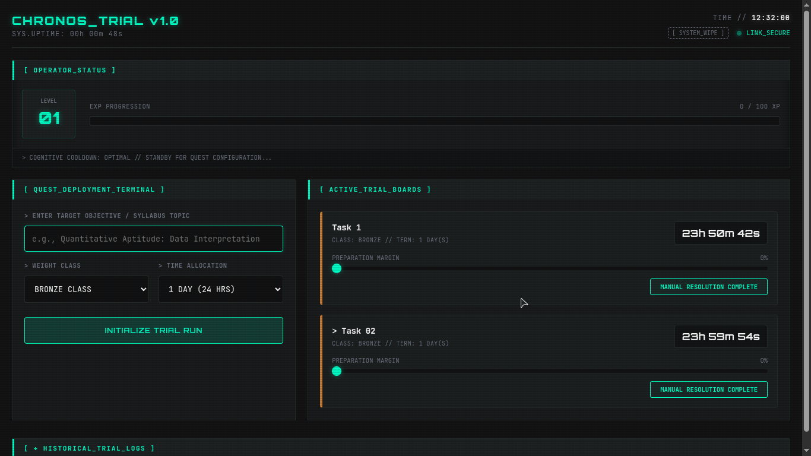
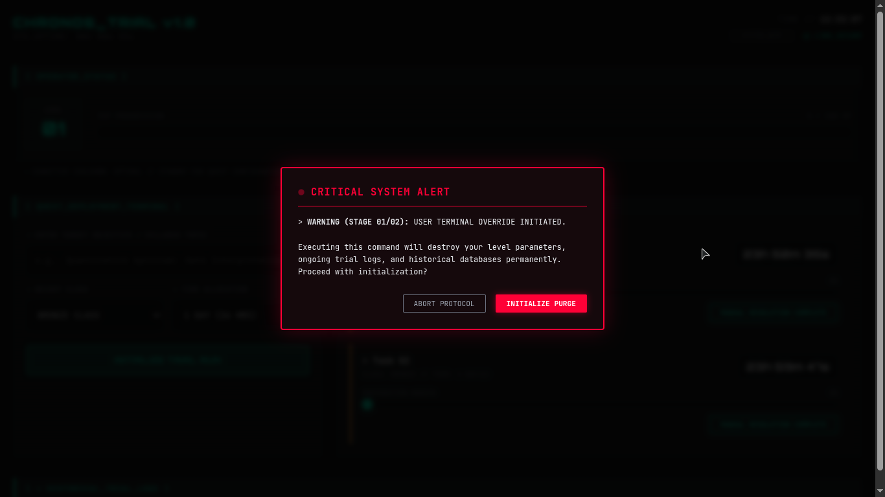
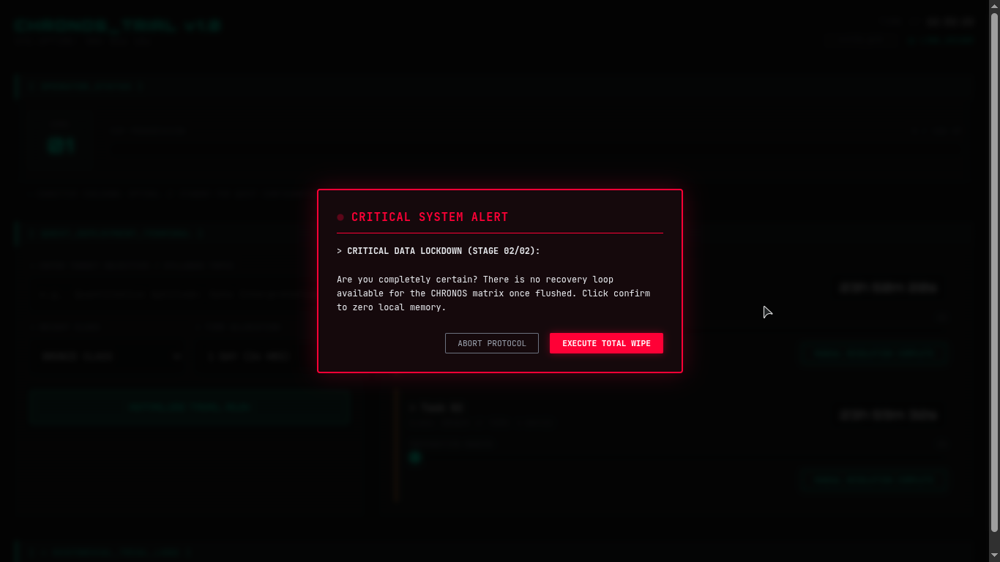

# CHRONOS_TRIAL v1.0

> **STATUS:** OPERATIONAL // **DESIGN SPEC:** TACTICAL CYBER-TERMINAL // **THEME:** NEON CYAN MATRIX

A lightweight, local-first web application engineered to transform standard task tracking into a structured, high-discipline training environment. Designed with a clean, low-friction, developer-centric terminal aesthetic, it helps track mid-to-long-term syllabus objectives, manage prep margins, and enforce strict execution windows.

---

## 🖥️ System Interface Telemetry

### Master Dashboard View

---

### 🚨 Custom Multi-Stage Crimson Purge Protocol
When a user initializes the `[ SYSTEM_WIPE ]` terminal override, a custom, dual-layer modal intercepts the native browser loops to enforce lockdown authorization:

| STAGE 01/02: Initialization Warning | STAGE 02/02: Critical Lockdown Verification |
| :---: | :---: |
|  |  |

---

## 🛠️ System Architecture

The ecosystem relies entirely on modern vanilla JavaScript APIs, requiring zero framework overhead or external compilation layers:

* **`index.html`** – Core UI structural blueprint. Contains layout containers for player stats, deployment terminals, active task grids, and historical ledger tables.
* **`style.css`** – The visual engine. Implements a responsive, dark tactical grid using neon cyan accents, custom range sliders, a custom-tuned scrolling matrix, and an integrated CRT scanline shader effect.
* **`storage.js`** – Persistent local data layer. Directly reads/writes to browser `localStorage` to manage player levels, real-time EXP distribution, active quest states, and archived data rows.
* **`timer.js`** – Drift-free timestamp mathematics engine. Translates calendar days into explicit absolute-future epoch values to maintain exact synchronization down to the millisecond.
* **`app.js`** – Central orchestration script. Binds DOM events, handles real-time ticker updates (1Hz system heartbeat), tracks slider interactions, and triggers auto-failures for lapsed objectives.

---

## ⚡ Core Operational Features

* **Gamified Discipline System:** Earn explicit EXP rewards graded by difficulty tiers (Bronze, Silver, Gold, Shadow) upon manual task completion. Accumulating enough EXP automatically increases your Player Level.
* **No-Drift Countdowns:** Tasks display live real-time countdown clocks. Timeouts are calculated using absolute futures, entirely bypassing standard browser execution drift.
* **Hard Overdue Enforcement:** The background engine scans system health every second. If an active task's timer drops below zero, it auto-fails instantly, locks out further progress editing, and permanently catalogs the attempt as a failure in the history logs.
* **Persistent Historical Ledger:** An expandable, slide-out data table maintains a historical record of all completed (`CLEAR ✓`) and failed (`FAILED ✗`) trials across browser reboots.
* **Fully Responsive Engine:** Incorporates explicit structural breakpoints ensuring smooth operation across ultra-wide desktop monitors down to mobile touchscreen viewports.
